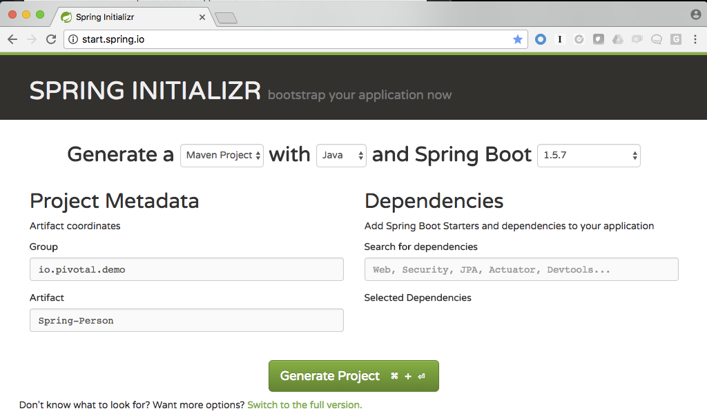
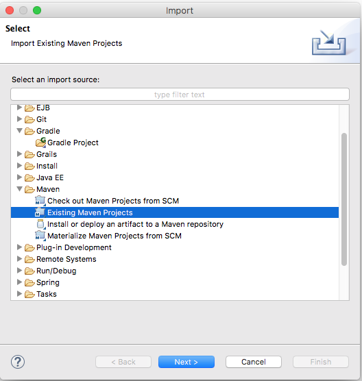
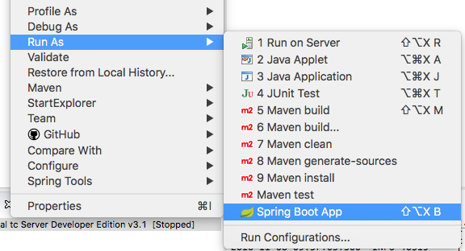
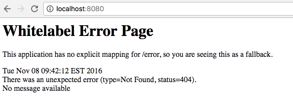
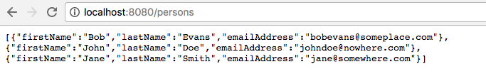

= Spring Boot / REST / Redis Tutorial 

[abstract]
--
In this tutorial, we will build a new Java REST application that is backed by Redis. 
--

== Prerequisites
*** link:http://www.oracle.com/technetwork/java/javase/downloads/jdk8-downloads-2133151.html[Java 1.8 SDK]
*** link:http://redis.io/[Redis] 
*** link:https://spring.io/tools[Spring Tool Suite] or link:https://www.jetbrains.com/idea/[IntelliJ] or link:https://eclipse.org/downloads/[Eclipse] 
*** link:https://github.com/cloudfoundry/cli/releases[CF CLI]
*** link:https://maven.apache.org/download.cgi[Apache Maven]

== Creating the project
. Go to link:http://start.spring.io[start.spring.io]
. Generate a *Maven Project* with Spring Boot version *1.3.8*
. In the Project Metadata section
.. Under Group, enter: *io.pivotal.demo* or something similar. This will be your Java package name
.. Under Artitfact enter: *Spring-Person* or something similar. This will be the name of your Java App
+

+
.. Under the Generate Project button, click the link to switch to the full version. We will now select the dependencies our application will have. 
.. Under the **Web Section**, select
... Web
... Jersey (JAX-RS)
.. Scroll down to the *SQL* and select
... JPA
.. Scroll down to the *NoSQL section* and select
... Redis
.. Scroll down to the *Cloud Discovery Section* and select
... Cloud Foundry Discovery

.. You are now ready generate the project so click the green "Generate Project" button. This will download your new Java project with the required dependencies for you. The downloaded file will be in a compressed (zip) file containing everything you need. 

== Importing into your IDE
. Uncompress the zip file to a location of your choosing. Remeber this location as we'll need it shortly.
. Now start up your favorite Java IDE. Spring Tool Suite, IntelliJ and Eclipse are common choices.
. The next step is to import the project you just uncompressed within your Java IDE. Look for an option to import an existing Maven project. Navigate to the folder and walk through the prompts. Note that the image below is captured from STS / Eclipse. 
+

+
. Build and Run your application. 
+

+
. Open a browser to navigate to http://localhost:8080. Notice that by default, the application is protected with Basic Authentication. If you look in the output log, you'll find the password which will look similar to this:
+
```
2016-11-08 09:37:02.511  INFO 40319 --- [ost-startStop-1] o.s.b.c.e.ServletRegistrationBean        : Mapping servlet: 'dispatcherServlet' to [/]
2016-11-08 09:37:02.711  INFO 40319 --- [ost-startStop-1] b.a.s.AuthenticationManagerConfiguration : 

Using default security password: xxxxxxxx-yyyy-zzzz-aaaa-bbbbbbbbbbbb 

2016-11-08 09:37:02.760  INFO 40319 --- [ost-startStop-1] o.s.s.web.DefaultSecurityFilterChain     : Creating filter chain: Ant [pattern='/css/**'], []
2016-11-08 09:37:02.760  INFO 40319 --- [ost-startStop-1] o.s.s.web.DefaultSecurityFilterChain     : Creating filter chain: Ant [pattern='/js/**'], []

```
+
. Use *user* as the user name and the password found in your output logs to log in. You'll see the following error:



So what just happened? We created a spring-initializer project with some dependencies, downloaded the project and then ran it. Under the covers, it is using https://projects.spring.io/spring-boot/[Spring Boot]. Spring Boot takes an opinionated view of building production-ready Spring applications. It favors convention over configuration and is designed to get you up and running very quickly. 

The example application that we just ran included Tomcat as an application server because of the choices made when generating the project earlier. 

== Disabling Security

Let's disable the need for entering in a user name and password. 

. Edit the application.properties file. It is located in the src/main/resources folder.
. Add the following line to the file
+
----
security.ignored=/**
----
+
. Save the file 
. Build and run the application. (Make sure you stop the running application first)
. Open a Browser and navigate to http://localhost:8080

Notice that now you are not prompted to log in to view the website. 

So what just happened? We effectively told the Security subsystem not to require security for anything under the top level folder. 

== Adding Domain Object

Let's continue to enhance our application by adding a domain object.

. Create a new Java Class called *Person* in the *io.pivotal.demo.domain* package
. This class will have 3 properties: firstName, lastName, and emailAddress. Use the following code snippet for the class:
+
```
public class Person {
	
	private String firstName;
	private String lastName;
	private String emailAddress;
	
	public Person() {		
	}
	
	public Person(String firstName, String lastName, String emailAddress) {
		this.firstName = firstName;
		this.lastName = lastName;
		this.emailAddress = emailAddress;
	}

	public String getFirstName() {
		return firstName;
	}

	public void setFirstName(String firstName) {
		this.firstName = firstName;
	}

	public String getLastName() {
		return lastName;
	}

	public void setLastName(String lastName) {
		this.lastName = lastName;
	}

	public String getEmailAddress() {
		return emailAddress;
	}

	public void setEmailAddress(String emailAddress) {
		this.emailAddress = emailAddress;
	}

	@Override
	public String toString() {
		return "Person [firstName=" + firstName + ", lastName=" + lastName
				+ ", emailAddress=" + emailAddress + "]";
	}

}
```
+
. Save the file

== Creating a Repostiory

Next let's create a repository to store the information. We'll use Redis for this example.

. Create a new Java Class called *PersonRepository* in the *io.pivotal.demo.repository* package. This class will implement the CrudRepository interface.
. Use the snippet below to create the contents of this class:
+
```
import java.util.ArrayList;
import java.util.List;
import java.util.Set;

import io.pivotal.demo.domain.Person;

import org.springframework.data.redis.core.HashOperations;
import org.springframework.data.redis.core.RedisTemplate;
import org.springframework.data.repository.CrudRepository;

public class PersonRepository implements CrudRepository<Person, String> {

	public static final String PERSONS_KEY = "persons";
	
	private final HashOperations<String, String, Person> hashOps;
	
	public PersonRepository(RedisTemplate<String, Person> redisTemplate) {
		this.hashOps = redisTemplate.opsForHash();
	}

	@Override
	public long count() {
		return hashOps.keys(PERSONS_KEY).size();
	}

	@Override
	public void delete(String emailAddress) {
		hashOps.delete(PERSONS_KEY, emailAddress);
	}

	@Override
	public void delete(Person person) {
		hashOps.delete(PERSONS_KEY,  person.getEmailAddress());
	}

	@Override
	public void delete(Iterable<? extends Person> persons) {
		for (Person p : persons) {
			delete(p);
		}		
	}

	@Override
	public void deleteAll() {
		Set<String> emails = hashOps.keys(PERSONS_KEY);
		for (String email : emails) {
			delete(email);
		}
		
	}

	@Override
	public boolean exists(String emailAddress) {
		return hashOps.hasKey(PERSONS_KEY,  emailAddress);
	}

	@Override
	public Iterable<Person> findAll() {
		return hashOps.values(PERSONS_KEY);
	}

	@Override
	public Iterable<Person> findAll(Iterable<String> emailAddresses) {
		return hashOps.multiGet(PERSONS_KEY, convertIterableToList(emailAddresses));
	}

	@Override
	public Person findOne(String emailAddress) {
		return hashOps.get(PERSONS_KEY, emailAddress);
	}

	@Override
	public <S extends Person> S save(S person) {
		hashOps.put(PERSONS_KEY, person.getEmailAddress(), person);
		
		return person;
	}

	@Override
	public <S extends Person> Iterable<S> save(Iterable<S> persons) {
		List<S> result = new ArrayList();
		
		for(S entity : persons) {
			save(entity);
			result.add(entity);
		}

		return result;
	}
	
	private <T> List<T> convertIterableToList(Iterable<T> iterable) {
        List<T> list = new ArrayList<>();
        for (T object : iterable) {
            list.add(object);
        }
        return list;
    }
}
```
+
. Save the file

== Creating a Repository Populator

Let's create a class that will load data into the repository. This class will hook into the application listener to determine if it should add data to the repository or not. 

. Create a new Java Class called *PersonRepositoryPopulator* in the *io.pivotal.demo.repository* package
. Use the snippet below to create the contents of this class:
+
```
import io.pivotal.demo.domain.Person;

import java.util.Collection;

import org.springframework.beans.BeansException;
import org.springframework.beans.factory.BeanFactoryUtils;
import org.springframework.context.ApplicationContext;
import org.springframework.context.ApplicationContextAware;
import org.springframework.context.ApplicationListener;
import org.springframework.context.event.ContextRefreshedEvent;
import org.springframework.core.io.ClassPathResource;
import org.springframework.core.io.Resource;
import org.springframework.data.repository.CrudRepository;
import org.springframework.data.repository.init.Jackson2ResourceReader;
import org.springframework.stereotype.Component;

import com.fasterxml.jackson.databind.DeserializationFeature;
import com.fasterxml.jackson.databind.ObjectMapper;

@Component
public class PersonRepositoryPopulator implements ApplicationListener<ContextRefreshedEvent>, ApplicationContextAware {
	
    private final Jackson2ResourceReader resourceReader;
    private final Resource sourceData;
    private ApplicationContext applicationContext;
    
    public PersonRepositoryPopulator()
    {
    	ObjectMapper mapper = new ObjectMapper();
        mapper.configure(DeserializationFeature.FAIL_ON_UNKNOWN_PROPERTIES, false);
        resourceReader = new Jackson2ResourceReader(mapper);
        sourceData = new ClassPathResource("persons.json");
    }

	@Override
	public void setApplicationContext(ApplicationContext applicationContext)
			throws BeansException {
		 this.applicationContext = applicationContext;
	}

	@Override
	public void onApplicationEvent(ContextRefreshedEvent event) {
		 if (event.getApplicationContext().equals(applicationContext)) {
	            CrudRepository personRepository =
	                    BeanFactoryUtils.beanOfTypeIncludingAncestors(applicationContext, CrudRepository.class);
	            if (personRepository != null && personRepository.count() == 0) {
	                populate(personRepository);
	            }
	        }
	}
	
    @SuppressWarnings("unchecked")
    public void populate(CrudRepository repository) {
        Object entity = getEntityFromResource(sourceData);

        if (entity instanceof Collection) {
            for (Person person : (Collection<Person>) entity) {
                if (person != null) {
                    repository.save(person);
                }
            }
        } else {
            repository.save(entity);
        }
    }

    private Object getEntityFromResource(Resource resource) {
        try {
            return resourceReader.readFrom(resource, this.getClass().getClassLoader());
        } catch (Exception e) {
            throw new RuntimeException(e);
        }
    }	
}

```
+
. Save the file

Let's create some sample data to load into the repository.

. Create a new file called *persons.json* in the *src/main/resources* folder
. Edit the contents of this file to contain the following. Feel free to add additional entries if you would like. 
+
```
[
	{
		"_class": "io.pivotal.demo.domain.Person",
		"emailAddress" : "johndoe@nowhere.com",
		"firstName" : "John",
		"lastName" : "Doe"
	},
	{
		"_class": "io.pivotal.demo.domain.Person",
		"emailAddress" : "jane@somewhere.com",
		"firstName" : "Jane",
		"lastName" : "Smith"
	},
	{
		"_class": "io.pivotal.demo.domain.Person",
		"emailAddress" : "bobevans@someplace.com",
		"firstName" : "Bob",
		"lastName" : "Evans"
	}
]		
```
+
. Save the file

The PersonRepositoryPopulator class reads the persons.json, attempts to parse it and if it finds a person array or object, populates the repository with the data, but only if there aren't records already in it.  

== Creating a Redis Configuration

Let's create a Redis Configuration that will be used to create Redis specific entites such as a RedisTemplate which is used to let Redis know how to serialize objects being stored in it.

. Create a new Java Class called *RedisConfig* in the *io.pivotal.demo.config* package
. Edit the contents of this file to contain the following:
+
```
import io.pivotal.demo.domain.Person;
import io.pivotal.demo.repository.PersonRepository;

import org.springframework.context.annotation.Bean;
import org.springframework.context.annotation.Configuration;
import org.springframework.data.redis.connection.RedisConnectionFactory;
import org.springframework.data.redis.core.RedisTemplate;
import org.springframework.data.redis.serializer.Jackson2JsonRedisSerializer;
import org.springframework.data.redis.serializer.RedisSerializer;
import org.springframework.data.redis.serializer.StringRedisSerializer;

@Configuration
public class RedisConfig {

	@Bean
	public PersonRepository repository(RedisTemplate<String, Person> redisTemplate) {
		return new PersonRepository(redisTemplate);
	}
	
	@Bean
	public RedisTemplate<String, Person> redisTemplate(RedisConnectionFactory redisConnectionFactory) {
		RedisTemplate<String, Person> template = new RedisTemplate();
		
		template.setConnectionFactory(redisConnectionFactory);
		
		RedisSerializer<String> stringSerializer = new StringRedisSerializer();
		RedisSerializer<Person> personSerializer = new Jackson2JsonRedisSerializer<>(Person.class);
		
		template.setKeySerializer(stringSerializer);
		template.setValueSerializer(personSerializer);
		template.setHashKeySerializer(stringSerializer);
		template.setHashValueSerializer(personSerializer);
		
		return template;
	}
}
```
+
. Save the file

This RedisConfig class is used to create a new Person Repository and to define the RedisTemplate for the Person class. One key thing to note is that it uses the @Bean annotation to declare a Spring Bean. A Spring Bean is an object that is instantiated, assembled and managed by Spring's Inversion of Control (IoC) container, allowing for Dependency Injection (DI). Note too that this class needs a _RedisConnectionFactory_ which we have not yet defined. 

== Creating a Local Redis Configuration

Since our goal is to run this application locally as well as in Pivotal Cloud Foundry, let's create a configuration for redis that we can use locally on our development machines. This class will define a Bean called _RedisConnectionFactory_ that our previous class needs.

. Create a new Java Class called *RedisLocalConfig* in the *io.pivotal.demo.config* package
. Edit the contents of this file to contain the following:
+
```
import org.springframework.context.annotation.Bean;
import org.springframework.context.annotation.Configuration;
import org.springframework.context.annotation.Profile;
import org.springframework.data.redis.connection.RedisConnectionFactory;
import org.springframework.data.redis.connection.jedis.JedisConnectionFactory;

@Configuration
@Profile("default")
public class RedisLocalConfig {

	@Bean 
	public RedisConnectionFactory redisConnection()
	{
		return new JedisConnectionFactory();
	}
}
```
+
. Save the file

Note that this class uses a @Profile annotation to take advantage of Spring Profiles. Spring Profiles provide a way to segregate parts of your application configuration and make it only available in certain environments. 

== Run the application

Let's run the application and test what we have done so far. Since we are running this locally, we need to make sure we have Redis up and running. To run on a mac use the following command:

```
$ redis-server /usr/local/etc/redis.conf
```
For other operating systems, consult the documentation.

To test that the redis server is up and running run the following command:

```
$ redis-cli ping
PONG
```
If it comes back with PONG the Redis server is running 

. Run your application
. Look at the application logs and see if you have any errors

```
2016-11-08 12:23:32.223 ERROR 42601 --- [           main] o.s.boot.SpringApplication               : Application startup failed

org.springframework.beans.factory.BeanCreationException: Error creating bean with name 'org.springframework.boot.autoconfigure.orm.jpa.HibernateJpaAutoConfiguration': Injection of autowired dependencies failed; nested exception is org.springframework.beans.factory.BeanCreationException: Could not autowire field: private javax.sql.DataSource org.springframework.boot.autoconfigure.orm.jpa.JpaBaseConfiguration.dataSource; nested exception is org.springframework.beans.factory.BeanCreationException: Error creating bean with name 'dataSource' defined in class path resource [org/springframework/boot/autoconfigure/jdbc/DataSourceAutoConfiguration$NonEmbeddedConfiguration.class]: Bean instantiation via factory method failed; nested exception is org.springframework.beans.BeanInstantiationException: Failed to instantiate [javax.sql.DataSource]: Factory method 'dataSource' threw exception; nested exception is org.springframework.boot.autoconfigure.jdbc.DataSourceProperties$DataSourceBeanCreationException: Cannot determine embedded database driver class for database type NONE. If you want an embedded database please put a supported one on the classpath. If you have database settings to be loaded from a particular profile you may need to active it (no profiles are currently active).

... (snipped)

Caused by: org.springframework.boot.autoconfigure.jdbc.DataSourceProperties$DataSourceBeanCreationException: Cannot determine embedded database driver class for database type NONE. If you want an embedded database please put a supported one on the classpath. If you have database settings to be loaded from a particular profile you may need to active it (no profiles are currently active).

```
Near the bottom of the stacktrace gives us a clue as to what might be wrong: Cannot determine embedded database driver class for database type NONE. 

Spring is attempting to instantiate an in-memory database and is not able to do so. To fix this do the following:

. Open up the *SpringPersonApplication* class in the *io.pivotal.demo* package. 
. Add the following imports
+
```
import org.springframework.boot.autoconfigure.EnableAutoConfiguration;
import org.springframework.boot.autoconfigure.jdbc.DataSourceAutoConfiguration;
import org.springframework.boot.autoconfigure.orm.jpa.HibernateJpaAutoConfiguration;
```
+
. And add the following annotation after the @SpringBootApplication but before the class definition:
+
```
@EnableAutoConfiguration(exclude = {DataSourceAutoConfiguration.class, HibernateJpaAutoConfiguration.class})
```
+
This annotation tells Spring to disable auto configuration for Hibernate JPA data sources.
. Save the class
. Run the application. The application should start without any errors.

Now let's validate that there is data in the Redis data store. Open a terminal session and type the following command:

```bash
$ redis-cli hgetall persons
1) "bobevans@someplace.com"
2) "{\"firstName\":\"Bob\",\"lastName\":\"Evans\",\"emailAddress\":\"bobevans@someplace.com\"}"
3) "johndoe@nowhere.com"
4) "{\"firstName\":\"John\",\"lastName\":\"Doe\",\"emailAddress\":\"johndoe@nowhere.com\"}"
5) "jane@somewhere.com"
6) "{\"firstName\":\"Jane\",\"lastName\":\"Smith\",\"emailAddress\":\"jane@somewhere.com\"}"
```
Notice that Redis returns the data that is found in persons.json, so if you added or changed some of the data, it would be reflected here.

== Creating REST Endpoints

Now that we have a domain object, and some sample data, the next step is to add REST endpoints that provide an API for manipulating the data.

. Create a new Java Class called *PersonController* in the *io.pivotal.demo.controller* package
. Edit the contents of this file to contain the following:
+
```
import javax.validation.Valid;

import io.pivotal.demo.domain.Person;

import org.springframework.beans.factory.annotation.Autowired;
import org.springframework.data.repository.CrudRepository;
import org.springframework.web.bind.annotation.PathVariable;
import org.springframework.web.bind.annotation.RequestBody;
import org.springframework.web.bind.annotation.RequestMapping;
import org.springframework.web.bind.annotation.RequestMethod;
import org.springframework.web.bind.annotation.RestController;

@RestController
@RequestMapping(value = "/persons")
public class PersonController {

	private CrudRepository<Person, String> repository;
	
	@Autowired
	public PersonController(CrudRepository<Person, String> repository)
	{
		this.repository = repository;
	}
	
	@RequestMapping(method = RequestMethod.GET)
	public Iterable<Person> persons()
	{
		return repository.findAll();
	}
	
	@RequestMapping(method = RequestMethod.PUT)
    public Person add(@RequestBody @Valid Person person) {
        return repository.save(person);
    }

    @RequestMapping(method = RequestMethod.POST)
    public Person update(@RequestBody @Valid Person person) {
        return repository.save(person);
    }

    @RequestMapping(value = "/{emailAddress:.+}", method = RequestMethod.GET)
    public Person getById(@PathVariable String emailAddress) {
        return repository.findOne(emailAddress);
    }

    @RequestMapping(value = "/{emailAddress:.+}", method = RequestMethod.DELETE)
    public void deleteById(@PathVariable String emailAddress) {
        repository.delete(emailAddress);
    }	
}
```
+
. Save the File
. Run the application
. Open a browser and navigate to the following URL: http://localhost:8080/persons



What does this class do? First, it defines a @RestController located at the /persons URI. When running locally, this means the URL would be http://localhost:8080/persons. 

Inside of this class, the constructor is annotated with the @Autowired attribute which let's Spring know it will be constructing this class on our behalf. That way, we can determine later what CrudRepository we want to use. In our case, we only have one implementation, but you could add a MySQL or HSQL or another implmentation at a later date if you wanted to. 

Then we have various methods that are annotated with a specific @RequestMapping annotation that indicates when this method should be called. For example, in the case of the _Iterable_ method, it returns a Iterator over a collection of Persons. Similarly there are other methods that allow you to find an person by email address (_getById()_ using an HTTP GET), add a new person (_add()_ using HTTP PUT), updating a person (_update()_ using HTTP POST) and deleting a person (_deleteById()_ using HTTP DELETE).

Another interesting thing to note here is that there are annotations that map a Request Body (@RequestBody) to a Person instance. So in the case of the _update()_ method, when sending a request to update, Spring is expecting to find a Person object in the request body, pulls it out , creates a Person object and calls the update method. It is taking care of the usual work of parsing the body, deserializing the parameters, validating them and then constructing the object required. 

Validate that the other endpoints work by using a REST tool like curl or a browser plugin to add, retrieve, update, and delete a person from your repository. 

==== Adding a New Record

```
$ curl -H "Content-Type: application/json" -X PUT  -d '{"firstName":"My","lastName":"Name","emailAddress":"myname@example.com"}' http://localhost:8080/persons
$ redis-cli hgetall persons  
```

==== Retrieving a Record

```
$ curl -H "Content-Type: application/json" -X GET http://localhost:8080/persons/myname%40example.com
$ redis-cli hgetall persons  
```

==== Updating a Record

```
$ curl -H "Content-Type: application/json" -X POST  -d '{"firstName":"My","lastName":"RealName","emailAddress":"myname@example.com"}' http://localhost:8080/persons
$ redis-cli hgetall persons 
```
==== Deleting a Record

```
$ curl -H "Content-Type: application/json" -X DELETE http://localhost:8080/persons/myname%40example.com
$ redis-cli hgetall persons 
```

== Adding Cloud Configuration

Now that we have debugged our application and are satisfied with how it is working, it's time to look at what it will take to deploy it to Pivotal Cloud Foundry. Remember when we created the RedisLocalConfig class? We need to add a configuration profile for a cloud deployment. Let's do that now:

. Create a new Java Class called *RedisCloudConfig* in the *io.pivotal.demo.config* package
. Edit the contents of this file to contain the following:
+
```
import org.springframework.cloud.config.java.AbstractCloudConfig;
import org.springframework.context.annotation.Bean;
import org.springframework.context.annotation.Configuration;
import org.springframework.context.annotation.Profile;
import org.springframework.data.redis.connection.RedisConnectionFactory;

@Configuration
@Profile("cloud")
public class RedisCloudConfig extends AbstractCloudConfig {

	@Bean
	public RedisConnectionFactory redisConnection()
	{
		return connectionFactory().redisConnectionFactory();
	}
}
```
+
What does this class do? It uses a Spring @Profile attribute to indicate that this class should only be instanciated when "cloud" is defined. When you run an application in Pivotal Cloud Foundry, this profile is automatically enabled. You can also specify which profile you want to run by setting the spring.profiles.active environment variable if you want to use something other than cloud.
+
. Run the application locally 
. Open a browser and hit the following URL: http://localhost:8080/persons
+ 
Notice that the application is still working locally. 

== Pushing to Pivotal Cloud Foundry

Now we have all the pieces to run this in Pivotal Cloud Foundry. 

. If you haven't already, download the latest release of the Cloud Foundry CLI from link:https://github.com/cloudfoundry/cli/releases[CF CLI] for your operating system and install it.

. Set the API target for the CLI: (set appropriate end point for your environment)
+
----
$ cf api https://api.sys.cloud.rick-ross.com --skip-ssl-validation
----

. Login to Pivotal Cloudfoundry:
+
----
$ cf login
----
+
. Follow the prompts
. Build the application jar file
+
```
$ cd <location of your project>
$ mvn clean package
```
+
This creates a self-contained Jar file for the application in the _target_ folder. As an alternative, you can create the jar file within your IDE. For the purposes of this example, it is assumed that the locaiton of the jar file is in the _target_ folder
+
. Push the application using the following command line
+
```
$ cf push spring-person --no-start --random-route -p target/Spring-Person-0.0.1-SNAPSHOT.jar
Creating app spring-person in org Pivotal / space Development as rross@pivotal.io...
OK

Creating route spring-person-jazzy-necessitousness.app.cloud.rick-ross.com...
OK

Binding spring-person-jazzy-necessitousness.app.cloud.rick-ross.com to spring-person...
OK

Uploading spring-person...
Uploading app files from: /var/folders/mw/n4bhxvfn7wb4dw9rz8kznwcw0000gp/T/unzipped-app438824037
Uploading 1.2M, 133 files
Done uploading
OK
```
+
This command uploads the application to Pivotal Cloud Foundry, and does not start it because we still need to set up a Redis service. 
. Browse the Marketplace
+
```
$ cf marketplace
Getting services from marketplace in org Pivotal / space Development as rross@pivotal.io...
OK

service                       plans                     description
app-autoscaler                bronze, gold              Scales bound applications in response to load (beta)
p-circuit-breaker-dashboard   standard                  Circuit Breaker Dashboard for Spring Cloud Applications
p-config-server               standard                  Config Server for Spring Cloud Applications
p-mysql                       100mb-dev                 MySQL service for application development and testing
p-rabbitmq                    standard                  RabbitMQ is a robust and scalable high-performance multi-protocol messaging broker.
p-redis                       dedicated-vm, shared-vm   Redis service to provide a key-value store
p-service-registry            standard                  Service Registry for Spring Cloud Applications

TIP:  Use 'cf marketplace -s SERVICE' to view descriptions of individual plans of a given service.
```
+
Notice that there is a Redis service we can use. It is called "p-redis" and there are two plans: dedicated-vm and shared-vm. 
+
. Create a Redis service using the shared-vm plan
+
```
$ cf create-service p-redis shared-vm SpringPersonRedis
OK
```
+
. Bind the application to this service
+
```
$ cf bind-service spring-person SpringPersonRedis
OK
TIP: Use 'cf restage spring-person' to ensure your env variable changes take effect
```
+
. Start the application
+
```
$ cf start spring-person
Starting app spring-person in org Pivotal / space Development as rross@pivotal.io...
Downloading dotnetcore...
Downloading nodejs_buildpack...
Downloading staticfile_buildpack...
Downloading java_buildpack_offline...
Downloading go_buildpack...
Downloaded nodejs_buildpack
Downloading python_buildpack...
Downloaded staticfile_buildpack
Downloading php_buildpack...
Downloaded dotnetcore
Downloading binary_buildpack...
Downloaded go_buildpack
Downloading ruby_buildpack...
Downloaded java_buildpack_offline
Downloaded php_buildpack
Downloaded binary_buildpack
Downloaded ruby_buildpack
Downloaded python_buildpack
Creating container
Successfully created container
Downloading app package...
Downloaded app package (33.8M)
Staging...
-----> Java Buildpack Version: v3.8.1 (offline) | https://github.com/cloudfoundry/java-buildpack.git#29c79f2
-----> Downloading Open Jdk JRE 1.8.0_91-unlimited-crypto from https://java-buildpack.cloudfoundry.org/openjdk/trusty/x86_64/openjdk-1.8.0_91-unlimited-crypto.tar.gz (found in cache)
       Expanding Open Jdk JRE to .java-buildpack/open_jdk_jre (1.0s)
-----> Downloading Open JDK Like Memory Calculator 2.0.2_RELEASE from https://java-buildpack.cloudfoundry.org/memory-calculator/trusty/x86_64/memory-calculator-2.0.2_RELEASE.tar.gz (found in cache)
       Memory Settings: -Xss349K -Xmx681574K -XX:MaxMetaspaceSize=104857K -Xms681574K -XX:MetaspaceSize=104857K
-----> Downloading Spring Auto Reconfiguration 1.10.0_RELEASE from https://java-buildpack.cloudfoundry.org/auto-reconfiguration/auto-reconfiguration-1.10.0_RELEASE.jar (found in cache)
Exit status 0
Staging complete
Uploading droplet, build artifacts cache...
Uploading build artifacts cache...
Uploading droplet...
Uploaded build artifacts cache (109B)
Uploaded droplet (79.4M)
Uploading complete
Destroying container
Successfully destroyed container

0 of 1 instances running, 1 starting
1 of 1 instances running

App started


OK

App spring-person was started using this command `CALCULATED_MEMORY=$($PWD/.java-buildpack/open_jdk_jre/bin/java-buildpack-memory-calculator-2.0.2_RELEASE -memorySizes=metaspace:64m..,stack:228k.. -memoryWeights=heap:65,metaspace:10,native:15,stack:10 -memoryInitials=heap:100%,metaspace:100% -stackThreads=300 -totMemory=$MEMORY_LIMIT) && JAVA_OPTS="-Djava.io.tmpdir=$TMPDIR -XX:OnOutOfMemoryError=$PWD/.java-buildpack/open_jdk_jre/bin/killjava.sh $CALCULATED_MEMORY" && SERVER_PORT=$PORT eval exec $PWD/.java-buildpack/open_jdk_jre/bin/java $JAVA_OPTS -cp $PWD/. org.springframework.boot.loader.JarLauncher`

Showing health and status for app spring-person in org Pivotal / space Development as rross@pivotal.io...
OK

requested state: started
instances: 1/1
usage: 1G x 1 instances
urls: spring-person-jazzy-necessitousness.app.cloud.rick-ross.com
last uploaded: Tue Nov 8 22:15:54 UTC 2016
stack: cflinuxfs2
buildpack: java-buildpack=v3.8.1-offline-https://github.com/cloudfoundry/java-buildpack.git#29c79f2 java-main open-jdk-like-jre=1.8.0_91-unlimited-crypto open-jdk-like-memory-calculator=2.0.2_RELEASE spring-auto-reconfiguration=1.10.0_RELEASE

     state     since                    cpu    memory         disk           details
#0   running   2016-11-08 05:25:55 PM   0.0%   407.5M of 1G   161.7M of 1G
```
+
. Open a browser and go to the URL indicated in the urls: line above, with "/persons" appended to the end of it. In this case the url is https://spring-person-jazzy-necessitousness.app.cloud.rick-ross.com/persons
+

image::running-on-pcf.png[]

== Creating a Manifest

To make it easier to push updates to Pivotal Cloud Foundry, let's create a manifest file. 

. Create a file called manifest.yml and put it in the same folder that contains the pom.xml file. 
. Edit the contents of this file to contain the following:
+
```
---
applications:
- name: spring-person
  memory: 1G
  random-route: true
  path: target/Spring-Person-0.0.1-SNAPSHOT.jar
  services:
   - SpringPersonRedis
```
+
. Save the file
. Push the application again this time with no arguments
+
```
$ cf push
```
+
. Open a browser and navigate to the /persons URL to verify the applicaiton is working

